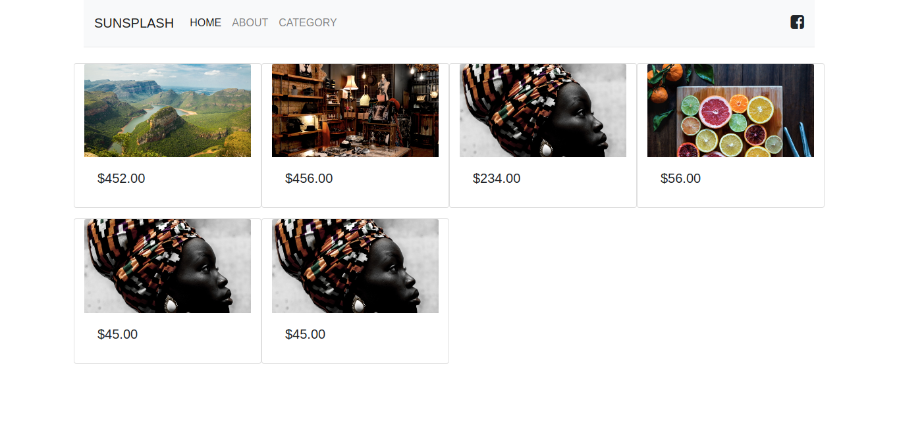
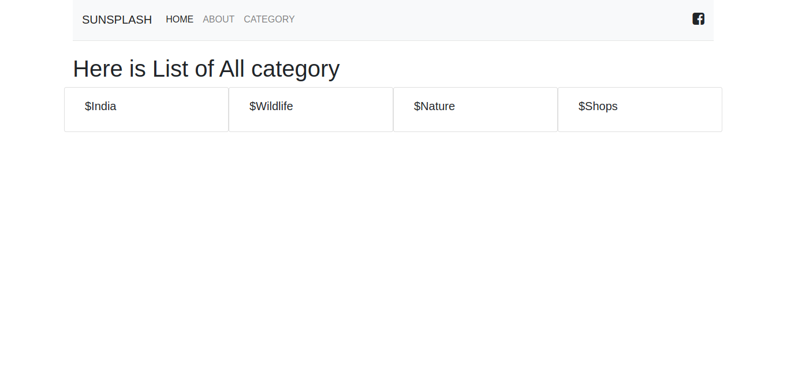
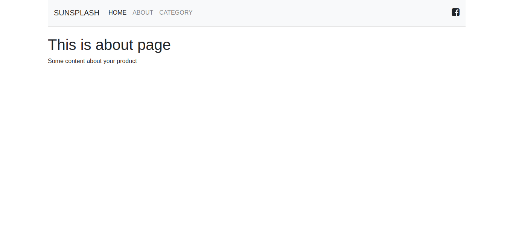

# About
- Its a gallery app which will list all Photos/painting/things for sale/showcase

# Local setup
- `cp .env.example .env`
- `docker-compose up -d` - start DB
- `python manage.py runserver`
- `python manage.py createsuperuser` -> login to admin -> populate the DB

# TODO:
[] - Add comments
[] - Onclick of category, we should take him to the ProductList of category
[] - detail view of product

# Screenshot

# 

#
